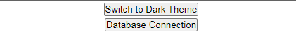
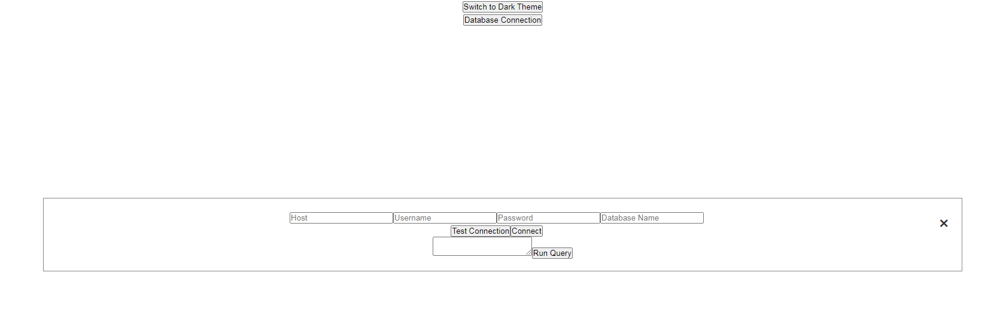
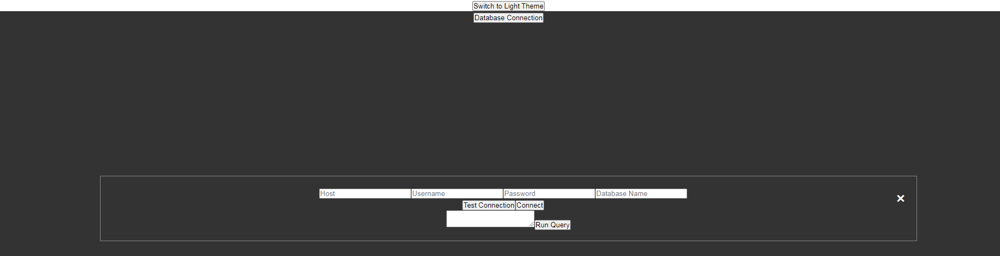
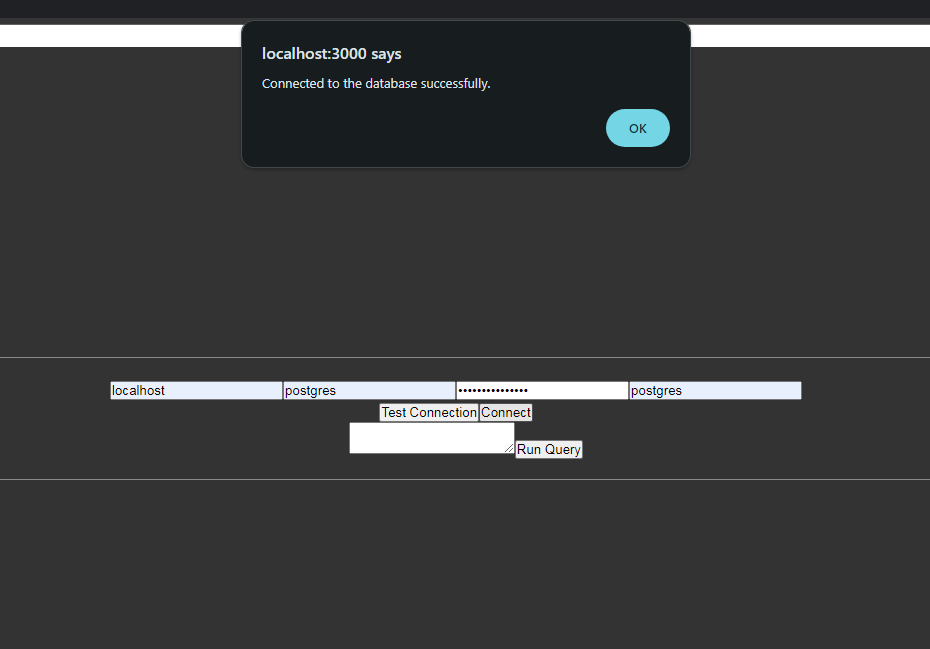
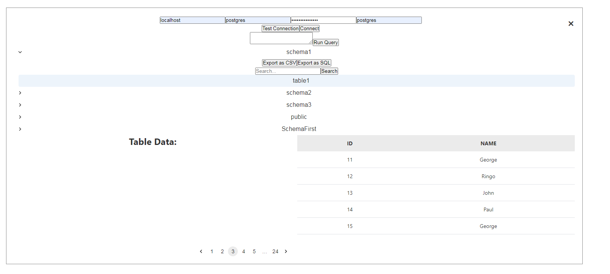

# Project: PostgreSQL DB explorer

## Description
Build a PostgreSQL DB explorer like pgAdmin

## Requirements
- On Login page, there should be modal where you can input DB credentials (host, user, password, database)
    - There are 2 buttons in the modal.
        - "Test Connection" - Test DB connection availability and show result in Toast (error or success)
        - "Connect" - Connect to the database. If it's not able to connect to the DB, then show Toast error message. Otherwise, show Toast success message and close poup and navigate to dashboard page
- Display list of DB schemas and tables in left panel of the screen (tree view)
- When user selects one of the DB tables in the tree view, he/she should see all the table data
    - Implement the pagination (5 items per page)
- Make "SQL Runner" button where user can input custom SQL on the modal.
    - After confirming the query on the popup, user should be able to see the result in the table. (Also implement pagination)
- Make "Search" input box in the modal where user can search data in the DB table.
- Make "Export" button in the modal where user can export all the data in CSV or SQL format.
- Implement light/dark theme.
- Implement mobile responsiveness.

## Screenshots






## Frontend
### Tech Stacks
- React
- TypeScript
- MUI
- React-Spinners

## Backend
### Tech Stacks
- Node.js
- Express.js
- CORS module

### API Features
- `/api/test-connection`: Receives host, username, password, and database from frontend and tests the status of the connection.
- `/api/connect`: Receives host, username, password, and database from frontend and if the connection is made, shows all the schemas and tables.
- `/api/table/:schema/:table`: Receives schema and table from frontend and with having them, get all the data with that table of that schema.
- `/api/run-sql`: Receives the request that looks like a sql query and it runs that query.
- `/api/search`: Search the names based on the keyword given the schema and the table that are included in request body.
- `/api/export`: Implement export functionality for all the data in given table of given schema.


## Installation

1. Clone the repository

2. Set up the node modules on both front end and back end side
- Please use Node 16.14.0

```shell
npm install
```

3. Run the program

- Front-end

```shell
npm start
```

- Back-end
```shell
node server.js
```

4. Open your web browser and visit `http://localhost:3000/` to see the application running.